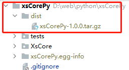

# xsCorePy
### xsCorePy python版工具类

### 安装本库:
> pip install xsCorePy
> 
pypi主页:
https://pypi.org/project/xsCorePy/

### 模块打包并上传到pypi：
如果你是项目使用者可以忽略以下，以下是给开发者写的项目打包流程：
 
##### 一.建立setup.py文件
setup.py要与当前项目的父级文件夹同一级别,具体参照本项目
setup.py的内容请参照xsCorePy/setup.py

##### 二.打包项目
在终端输入：
> python setup.py sdist  

注:如果是在cmd下，要cd到setup.py同级目录下再执行以上命令
打包完成后，可以看到同级别目录下多出了一个dist目录
目录下有xsCorePy-1.0.0.tar.gz就是我们的打包好的包

接下来要将这个xsCorePy-1.0.0.tar.gz上传到pypi.org

##### 三.注册pypi账号
 打开  https://pypi.org/ 直接注册就好，注意要验证邮箱

##### 四.安装包上传工具
最好是在全局环境下安装
> pip install twine

##### 五.上传包 
因为是在全局环境下安装的twine，在项目终端的python环境下不一定有twine
所以直接打开cmd,cd到...dist/下,执行:
> twine upload xsCorePy-1.0.0.tar.gz

##### 六.输入pypi.org的账号与密码
执行完第上一步后，会要求输入在pypi.org的账号与密码
输入正确的账号密码即可上传
登录到pypi.org 
打开 https://pypi.org/manage/projects/
即可查看到自己上传的项目

